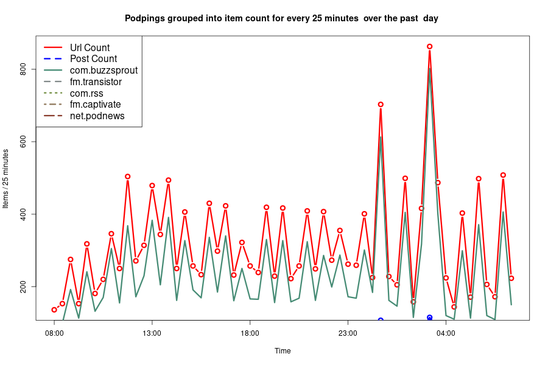
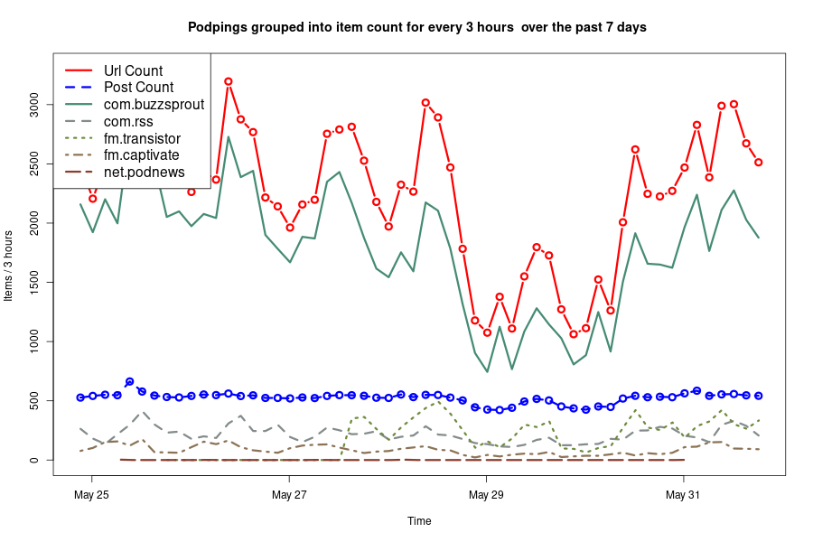
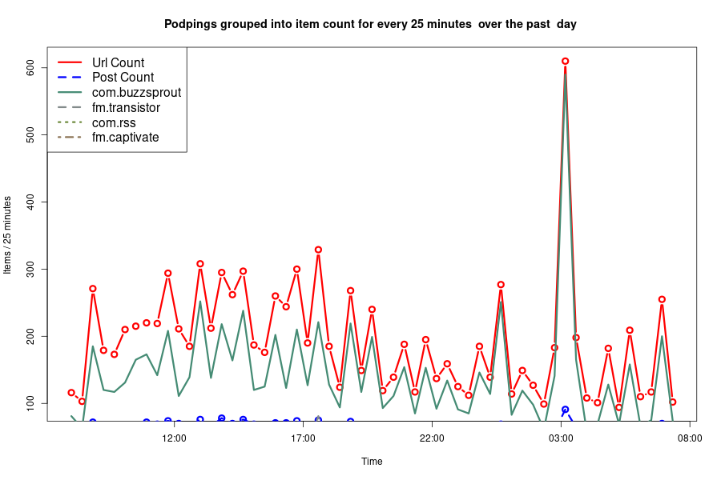
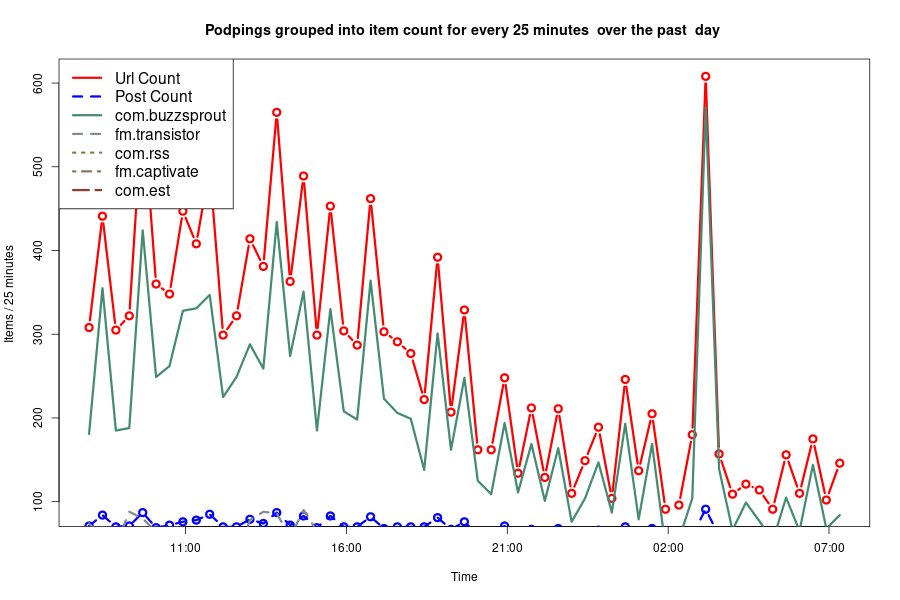
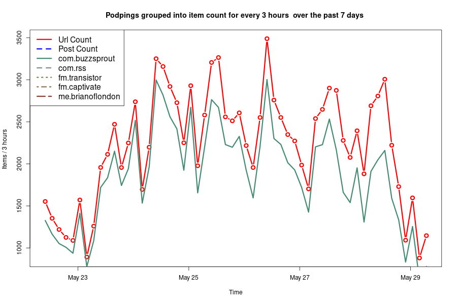

# Domain Stats
<html lang="en">
<head>
<meta charset="utf-8"/>

</head>
<body>
<<<<<<< HEAD

=======

>>>>>>> 0f2b83bb9c8222691c86eb84646d92513852192d
  
  <table class="gt_table">
  <thead class="gt_header">
    <tr>
      <th colspan="4" class="gt_heading gt_title gt_font_normal" style>Podping report for the last  day </th>
    </tr>
    <tr>
      <th colspan="4" class="gt_heading gt_subtitle gt_font_normal gt_bottom_border" style>Podping urls are 'custom json' posts on the Hive.io block chain</th>
    </tr>
  </thead>
  <thead class="gt_col_headings">
    <tr>
      <th class="gt_col_heading gt_columns_bottom_border gt_left" rowspan="1" colspan="1">domain</th>
      <th class="gt_col_heading gt_columns_bottom_border gt_right" rowspan="1" colspan="1">url count</th>
      <th class="gt_col_heading gt_columns_bottom_border gt_right" rowspan="1" colspan="1">url/minute</th>
      <th class="gt_col_heading gt_columns_bottom_border gt_right" rowspan="1" colspan="1">share (%)</th>
    </tr>
  </thead>
  <tbody class="gt_table_body">
    <tr><td class="gt_row gt_left">com.buzzsprout</td>
<<<<<<< HEAD
<td class="gt_row gt_right">100532</td>
<td class="gt_row gt_right">10.0</td>
<td class="gt_row gt_right">79.5</td></tr>
    <tr><td class="gt_row gt_left">com.rss</td>
<td class="gt_row gt_right">12110</td>
<td class="gt_row gt_right">1.2</td>
<td class="gt_row gt_right">9.6</td></tr>
    <tr><td class="gt_row gt_left">fm.transistor</td>
<td class="gt_row gt_right">8958</td>
<td class="gt_row gt_right">0.9</td>
<td class="gt_row gt_right">7.1</td></tr>
    <tr><td class="gt_row gt_left">fm.captivate</td>
<td class="gt_row gt_right">4829</td>
<td class="gt_row gt_right">0.5</td>
<td class="gt_row gt_right">3.8</td></tr>
    <tr><td class="gt_row gt_left">net.podnews</td>
<td class="gt_row gt_right">11</td>
<td class="gt_row gt_right">0.0</td>
<td class="gt_row gt_right">0.0</td></tr>
    <tr><td class="gt_row gt_left">com.est</td>
<td class="gt_row gt_right">2</td>
<td class="gt_row gt_right">0.0</td>
<td class="gt_row gt_right">0.0</td></tr>
    <tr><td class="gt_row gt_left">me.brianoflondon</td>
<td class="gt_row gt_right">2</td>
=======
<td class="gt_row gt_right">12447</td>
<td class="gt_row gt_right">8.6</td>
<td class="gt_row gt_right">73.1</td></tr>
    <tr><td class="gt_row gt_left">fm.transistor</td>
<td class="gt_row gt_right">2461</td>
<td class="gt_row gt_right">1.7</td>
<td class="gt_row gt_right">14.4</td></tr>
    <tr><td class="gt_row gt_left">com.rss</td>
<td class="gt_row gt_right">1537</td>
<td class="gt_row gt_right">1.1</td>
<td class="gt_row gt_right">9.0</td></tr>
    <tr><td class="gt_row gt_left">fm.captivate</td>
<td class="gt_row gt_right">587</td>
<td class="gt_row gt_right">0.4</td>
<td class="gt_row gt_right">3.4</td></tr>
    <tr><td class="gt_row gt_left">net.podnews</td>
<td class="gt_row gt_right">3</td>
>>>>>>> 0f2b83bb9c8222691c86eb84646d92513852192d
<td class="gt_row gt_right">0.0</td>
<td class="gt_row gt_right">0.0</td></tr>
  </tbody>
  <tfoot class="gt_sourcenotes">
    <tr>
<<<<<<< HEAD
      <td class="gt_sourcenote" colspan="4">Total urls posted is 126441 of which 38757 are unique
		(average of 4.3 urls/post)
=======
      <td class="gt_sourcenote" colspan="4">Total urls posted is 17035 of which 8257 are unique
		(average of 4.17 urls/post)
>>>>>>> 0f2b83bb9c8222691c86eb84646d92513852192d
	#podping #Stats 
</td>
    </tr>
  </tfoot>
  
</table>

</body>
</html>
# Past reports 
<<<<<<< HEAD
- [2021-05-31-day-url-report.html](2021-05-31-day-url-report.html)
- [2021-05-31-7 days-url-report.html](2021-05-31-7 days-url-report.html)
=======
>>>>>>> 0f2b83bb9c8222691c86eb84646d92513852192d
- [2021-05-30-day-url-report.html](2021-05-30-day-url-report.html)
- [2021-05-29-day-url-report.html](2021-05-29-day-url-report.html)
- [2021-05-29-7 days-url-report.html](2021-05-29-7 days-url-report.html)
- [2021-05-29-28.3 days-url-report.html](2021-05-29-28.3 days-url-report.html)

# Past charts
<<<<<<< HEAD

=======
>>>>>>> 0f2b83bb9c8222691c86eb84646d92513852192d

