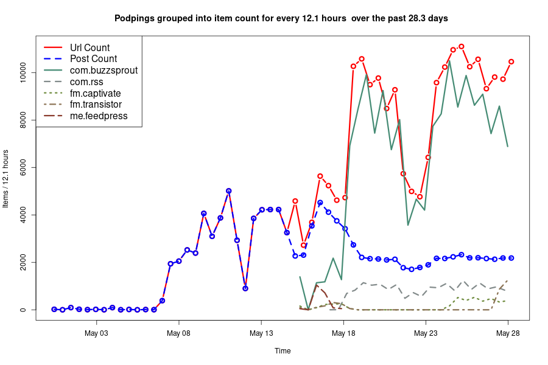

# Domain Stats
<html lang="en">
<head>
<meta charset="utf-8"/>

</head>
<body>

  
  <table class="gt_table">
  <thead class="gt_header">
    <tr>
      <th colspan="4" class="gt_heading gt_title gt_font_normal" style>Podping report for the last 28.3 days </th>
    </tr>
    <tr>
      <th colspan="4" class="gt_heading gt_subtitle gt_font_normal gt_bottom_border" style>Podping urls are 'custom json' posts on the Hive.io block chain</th>
    </tr>
  </thead>
  <thead class="gt_col_headings">
    <tr>
      <th class="gt_col_heading gt_columns_bottom_border gt_left" rowspan="1" colspan="1">domain</th>
      <th class="gt_col_heading gt_columns_bottom_border gt_right" rowspan="1" colspan="1">url count</th>
      <th class="gt_col_heading gt_columns_bottom_border gt_right" rowspan="1" colspan="1">url/minute</th>
      <th class="gt_col_heading gt_columns_bottom_border gt_right" rowspan="1" colspan="1">share (%)</th>
    </tr>
  </thead>
  <tbody class="gt_table_body">
    <tr><td class="gt_row gt_left">com.buzzsprout</td>
<td class="gt_row gt_right">166120</td>
<td class="gt_row gt_right">4.1</td>
<td class="gt_row gt_right">80.8</td></tr>
    <tr><td class="gt_row gt_left">com.rss</td>
<td class="gt_row gt_right">18998</td>
<td class="gt_row gt_right">0.5</td>
<td class="gt_row gt_right">9.2</td></tr>
    <tr><td class="gt_row gt_left">fm.captivate</td>
<td class="gt_row gt_right">4346</td>
<td class="gt_row gt_right">0.1</td>
<td class="gt_row gt_right">2.1</td></tr>
    <tr><td class="gt_row gt_left">fm.transistor</td>
<td class="gt_row gt_right">4018</td>
<td class="gt_row gt_right">0.1</td>
<td class="gt_row gt_right">2.0</td></tr>
    <tr><td class="gt_row gt_left">me.feedpress</td>
<td class="gt_row gt_right">1948</td>
<td class="gt_row gt_right">0.0</td>
<td class="gt_row gt_right">0.9</td></tr>
    <tr><td class="gt_row gt_left">com.simplecast</td>
<td class="gt_row gt_right">1817</td>
<td class="gt_row gt_right">0.0</td>
<td class="gt_row gt_right">0.9</td></tr>
    <tr><td class="gt_row gt_left">fm.anchor</td>
<td class="gt_row gt_right">1519</td>
<td class="gt_row gt_right">0.0</td>
<td class="gt_row gt_right">0.7</td></tr>
    <tr><td class="gt_row gt_left">com.whooshkaa</td>
<td class="gt_row gt_right">1263</td>
<td class="gt_row gt_right">0.0</td>
<td class="gt_row gt_right">0.6</td></tr>
    <tr><td class="gt_row gt_left">com.audioboom</td>
<td class="gt_row gt_right">765</td>
<td class="gt_row gt_right">0.0</td>
<td class="gt_row gt_right">0.4</td></tr>
    <tr><td class="gt_row gt_left">io.podigee</td>
<td class="gt_row gt_right">591</td>
<td class="gt_row gt_right">0.0</td>
<td class="gt_row gt_right">0.3</td></tr>
    <tr><td class="gt_row gt_left">com.95bfm</td>
<td class="gt_row gt_right">288</td>
<td class="gt_row gt_right">0.0</td>
<td class="gt_row gt_right">0.1</td></tr>
    <tr><td class="gt_row gt_left">me.firstory</td>
<td class="gt_row gt_right">207</td>
<td class="gt_row gt_right">0.0</td>
<td class="gt_row gt_right">0.1</td></tr>
    <tr><td class="gt_row gt_left">de.podcaster</td>
<td class="gt_row gt_right">133</td>
<td class="gt_row gt_right">0.0</td>
<td class="gt_row gt_right">0.1</td></tr>
    <tr><td class="gt_row gt_left">fm.emilcar</td>
<td class="gt_row gt_right">80</td>
<td class="gt_row gt_right">0.0</td>
<td class="gt_row gt_right">0.0</td></tr>
    <tr><td class="gt_row gt_left">org.lpm</td>
<td class="gt_row gt_right">80</td>
<td class="gt_row gt_right">0.0</td>
<td class="gt_row gt_right">0.0</td></tr>
    <tr><td class="gt_row gt_left">net.vpr</td>
<td class="gt_row gt_right">79</td>
<td class="gt_row gt_right">0.0</td>
<td class="gt_row gt_right">0.0</td></tr>
    <tr><td class="gt_row gt_left">de.viertausendhertz</td>
<td class="gt_row gt_right">73</td>
<td class="gt_row gt_right">0.0</td>
<td class="gt_row gt_right">0.0</td></tr>
    <tr><td class="gt_row gt_left">me.metaebene</td>
<td class="gt_row gt_right">72</td>
<td class="gt_row gt_right">0.0</td>
<td class="gt_row gt_right">0.0</td></tr>
    <tr><td class="gt_row gt_left">com.podcastmirror</td>
<td class="gt_row gt_right">67</td>
<td class="gt_row gt_right">0.0</td>
<td class="gt_row gt_right">0.0</td></tr>
    <tr><td class="gt_row gt_left">fm.sounder</td>
<td class="gt_row gt_right">67</td>
<td class="gt_row gt_right">0.0</td>
<td class="gt_row gt_right">0.0</td></tr>
    <tr><td class="gt_row gt_left">com.breakingtheglassslipper</td>
<td class="gt_row gt_right">64</td>
<td class="gt_row gt_right">0.0</td>
<td class="gt_row gt_right">0.0</td></tr>
    <tr><td class="gt_row gt_left">com.wordpress</td>
<td class="gt_row gt_right">60</td>
<td class="gt_row gt_right">0.0</td>
<td class="gt_row gt_right">0.0</td></tr>
    <tr><td class="gt_row gt_left">net.blubrry</td>
<td class="gt_row gt_right">59</td>
<td class="gt_row gt_right">0.0</td>
<td class="gt_row gt_right">0.0</td></tr>
    <tr><td class="gt_row gt_left">net.packetpushers</td>
<td class="gt_row gt_right">58</td>
<td class="gt_row gt_right">0.0</td>
<td class="gt_row gt_right">0.0</td></tr>
    <tr><td class="gt_row gt_left">com.pacific-content</td>
<td class="gt_row gt_right">56</td>
<td class="gt_row gt_right">0.0</td>
<td class="gt_row gt_right">0.0</td></tr>
  </tbody>
  <tfoot class="gt_sourcenotes">
    <tr>
      <td class="gt_sourcenote" colspan="4">Total urls posted is 206376 of which 53881 are unique
		(average of 1.78 urls/post)
	#podping #Stats 
</td>
    </tr>
  </tfoot>
  
</table>

</body>
</html>
# Past reports 
- [2021-05-29-28.3 days-url-report.html](2021-05-29-28.3 days-url-report.html)

# Past charts

