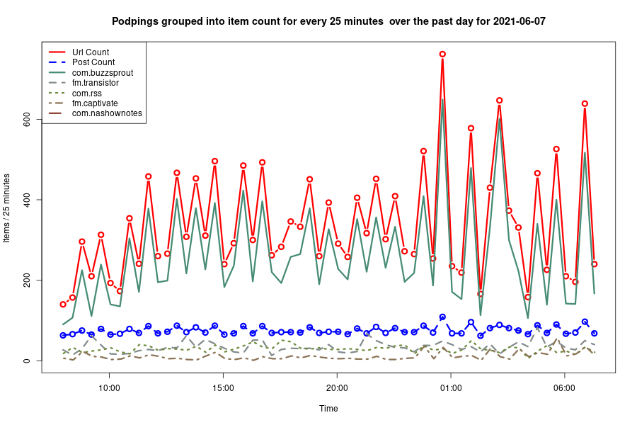
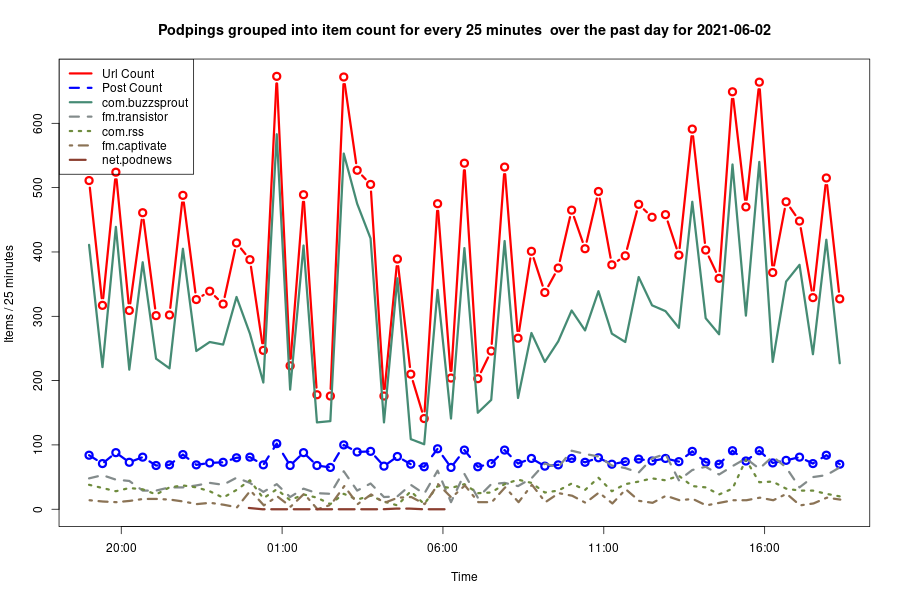
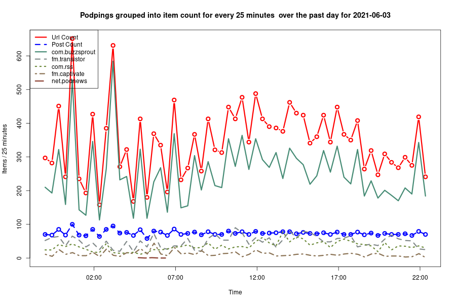
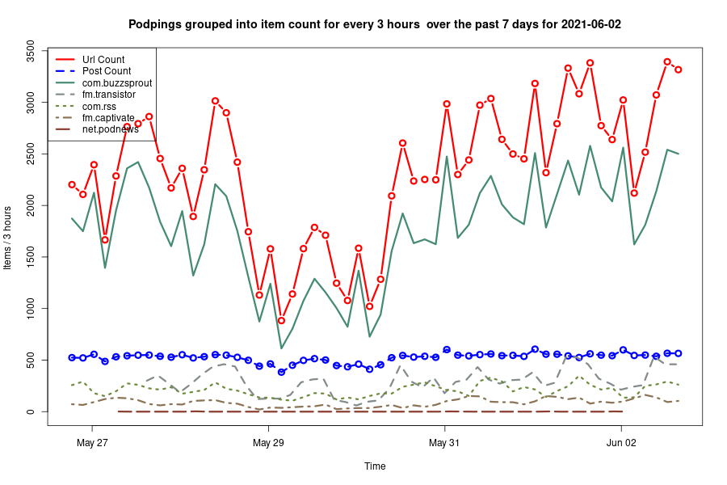
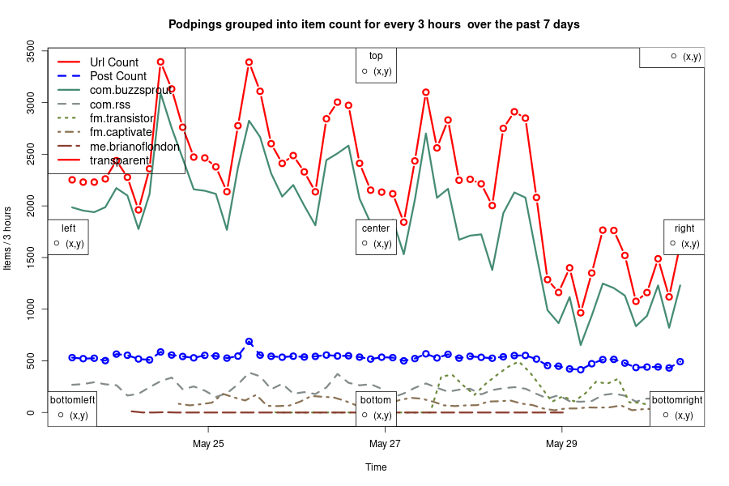

# Domain Stats
<html lang="en">
<head>
<meta charset="utf-8"/>

</head>
<body>

  
  <table class="gt_table">
  <thead class="gt_header">
    <tr>
      <th colspan="4" class="gt_heading gt_title gt_font_normal" style>Podping report for the last 30 days </th>
    </tr>
    <tr>
      <th colspan="4" class="gt_heading gt_subtitle gt_font_normal gt_bottom_border" style>Podping urls are 'custom json' posts on the Hive.io block chain</th>
    </tr>
  </thead>
  <thead class="gt_col_headings">
    <tr>
      <th class="gt_col_heading gt_columns_bottom_border gt_left" rowspan="1" colspan="1">domain</th>
      <th class="gt_col_heading gt_columns_bottom_border gt_right" rowspan="1" colspan="1">url count</th>
      <th class="gt_col_heading gt_columns_bottom_border gt_right" rowspan="1" colspan="1">url/minute</th>
      <th class="gt_col_heading gt_columns_bottom_border gt_right" rowspan="1" colspan="1">share (%)</th>
    </tr>
  </thead>
  <tbody class="gt_table_body">
    <tr><td class="gt_row gt_left">com.buzzsprout</td>
<td class="gt_row gt_right">321453</td>
<td class="gt_row gt_right">7.4</td>
<td class="gt_row gt_right">73.1</td></tr>
    <tr><td class="gt_row gt_left">com.rss</td>
<td class="gt_row gt_right">36324</td>
<td class="gt_row gt_right">0.8</td>
<td class="gt_row gt_right">8.3</td></tr>
    <tr><td class="gt_row gt_left">fm.transistor</td>
<td class="gt_row gt_right">30076</td>
<td class="gt_row gt_right">0.7</td>
<td class="gt_row gt_right">6.8</td></tr>
    <tr><td class="gt_row gt_left">fm.captivate</td>
<td class="gt_row gt_right">13530</td>
<td class="gt_row gt_right">0.3</td>
<td class="gt_row gt_right">3.1</td></tr>
    <tr><td class="gt_row gt_left">fm.anchor</td>
<td class="gt_row gt_right">6586</td>
<td class="gt_row gt_right">0.2</td>
<td class="gt_row gt_right">1.5</td></tr>
    <tr><td class="gt_row gt_left">com.simplecast</td>
<td class="gt_row gt_right">5883</td>
<td class="gt_row gt_right">0.1</td>
<td class="gt_row gt_right">1.3</td></tr>
    <tr><td class="gt_row gt_left">com.whooshkaa</td>
<td class="gt_row gt_right">4194</td>
<td class="gt_row gt_right">0.1</td>
<td class="gt_row gt_right">1.0</td></tr>
    <tr><td class="gt_row gt_left">me.feedpress</td>
<td class="gt_row gt_right">3001</td>
<td class="gt_row gt_right">0.1</td>
<td class="gt_row gt_right">0.7</td></tr>
    <tr><td class="gt_row gt_left">com.audioboom</td>
<td class="gt_row gt_right">2661</td>
<td class="gt_row gt_right">0.1</td>
<td class="gt_row gt_right">0.6</td></tr>
    <tr><td class="gt_row gt_left">io.podigee</td>
<td class="gt_row gt_right">2233</td>
<td class="gt_row gt_right">0.1</td>
<td class="gt_row gt_right">0.5</td></tr>
    <tr><td class="gt_row gt_left">me.firstory</td>
<td class="gt_row gt_right">680</td>
<td class="gt_row gt_right">0.0</td>
<td class="gt_row gt_right">0.2</td></tr>
    <tr><td class="gt_row gt_left">de.podcaster</td>
<td class="gt_row gt_right">474</td>
<td class="gt_row gt_right">0.0</td>
<td class="gt_row gt_right">0.1</td></tr>
    <tr><td class="gt_row gt_left">com.95bfm</td>
<td class="gt_row gt_right">451</td>
<td class="gt_row gt_right">0.0</td>
<td class="gt_row gt_right">0.1</td></tr>
    <tr><td class="gt_row gt_left">fm.sounder</td>
<td class="gt_row gt_right">311</td>
<td class="gt_row gt_right">0.0</td>
<td class="gt_row gt_right">0.1</td></tr>
    <tr><td class="gt_row gt_left">com.podcastmirror</td>
<td class="gt_row gt_right">294</td>
<td class="gt_row gt_right">0.0</td>
<td class="gt_row gt_right">0.1</td></tr>
    <tr><td class="gt_row gt_left">com.wordpress</td>
<td class="gt_row gt_right">233</td>
<td class="gt_row gt_right">0.0</td>
<td class="gt_row gt_right">0.1</td></tr>
    <tr><td class="gt_row gt_left">net.blubrry</td>
<td class="gt_row gt_right">208</td>
<td class="gt_row gt_right">0.0</td>
<td class="gt_row gt_right">0.0</td></tr>
    <tr><td class="gt_row gt_left">com.podbean</td>
<td class="gt_row gt_right">177</td>
<td class="gt_row gt_right">0.0</td>
<td class="gt_row gt_right">0.0</td></tr>
    <tr><td class="gt_row gt_left">me.brianoflondon</td>
<td class="gt_row gt_right">163</td>
<td class="gt_row gt_right">0.0</td>
<td class="gt_row gt_right">0.0</td></tr>
    <tr><td class="gt_row gt_left">fm.megaphone</td>
<td class="gt_row gt_right">149</td>
<td class="gt_row gt_right">0.0</td>
<td class="gt_row gt_right">0.0</td></tr>
    <tr><td class="gt_row gt_left">ar.com.radionacional</td>
<td class="gt_row gt_right">147</td>
<td class="gt_row gt_right">0.0</td>
<td class="gt_row gt_right">0.0</td></tr>
    <tr><td class="gt_row gt_left">net.vpr</td>
<td class="gt_row gt_right">147</td>
<td class="gt_row gt_right">0.0</td>
<td class="gt_row gt_right">0.0</td></tr>
    <tr><td class="gt_row gt_left">space.pod</td>
<td class="gt_row gt_right">147</td>
<td class="gt_row gt_right">0.0</td>
<td class="gt_row gt_right">0.0</td></tr>
    <tr><td class="gt_row gt_left">com.libsyn</td>
<td class="gt_row gt_right">142</td>
<td class="gt_row gt_right">0.0</td>
<td class="gt_row gt_right">0.0</td></tr>
    <tr><td class="gt_row gt_left">com.theticketfm</td>
<td class="gt_row gt_right">139</td>
<td class="gt_row gt_right">0.0</td>
<td class="gt_row gt_right">0.0</td></tr>
  </tbody>
  <tfoot class="gt_sourcenotes">
    <tr>
      <td class="gt_sourcenote" colspan="4">Total urls posted is 391327 of which 70878 are unique
		(average of 2.58 urls/post)
	#podping #Stats 
</td>
    </tr>
  </tfoot>
  
</table>

</body>
</html>

# Charts

# Past charts

# Past reports 
- [2021-06-08_30 days-url-report.html](2021-06-08_30 days-url-report.html)
- [2021-06-07_day-url-report.html](2021-06-07_day-url-report.html)
- [2021-06-02_day-url-report.html](2021-06-02_day-url-report.html)
- [2021-06-03_7 days-url-report.html](2021-06-03_7 days-url-report.html)
- [2021-06-03_day-url-report.html](2021-06-03_day-url-report.html)
- [2021-06-04_7 days-url-report.html](2021-06-04_7 days-url-report.html)
- [2021-06-04_day-url-report.html](2021-06-04_day-url-report.html)
- [2021-06-02_7 days-url-report.html](2021-06-02_7 days-url-report.html)
- [2021-06-01_7 days-url-report.html](2021-06-01_7 days-url-report.html)
- [2021-06-01_day-url-report.html](2021-06-01_day-url-report.html)
- [2021-05-31_7 days-url-report.html](2021-05-31_7 days-url-report.html)
- [2021-05-31_day-url-report.html](2021-05-31_day-url-report.html)
- [2021-05-30_day-url-report.html](2021-05-30_day-url-report.html)
- [2021-05-29_day-url-report.html](2021-05-29_day-url-report.html)
- [2021-05-29_7 days-url-report.html](2021-05-29_7 days-url-report.html)
- [2021-05-29_29 days-url-report.html](2021-05-29_29 days-url-report.html)
- [2021-06-01-7 days-url-report.html](2021-06-01-7 days-url-report.html)

